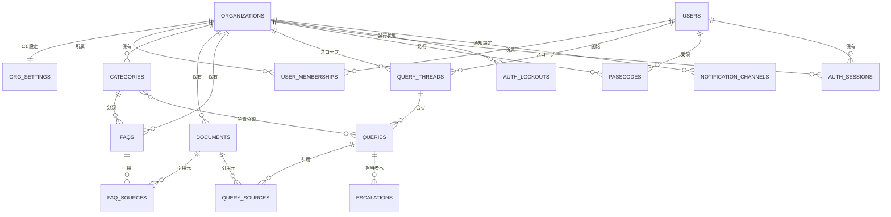
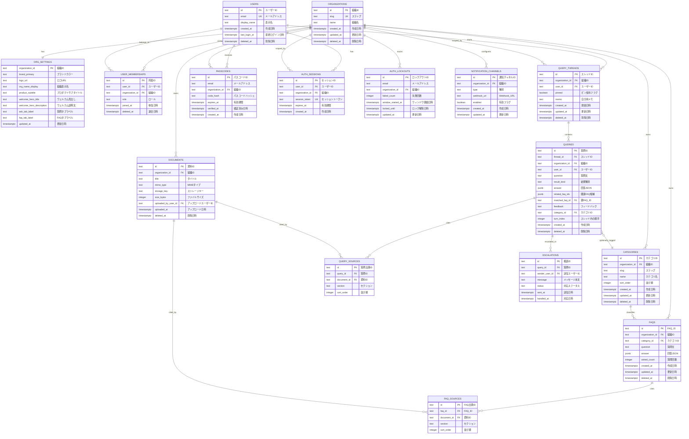

# DB 設計書 - オンボーディングシステム

## 前提

- DB: PostgreSQL
- ORM: Prisma
- ID: CUID / ULID を想定（文字列型 `TEXT`）
- 日時: `TIMESTAMPTZ`（UTC）
- マルチテナント: ほぼすべてのテーブルに `organization_id` を持たせ、組織スコープで検索する
- 物理削除は原則行わず、`deleted_at` での論理削除を基本とする（例外はパスコード等、すぐに消していいもの）
- テーブル・カラムには物理名（英語）と論理名（日本語）を併記する

## テーブル一覧（論理名対応）

| 物理名 | 論理名 | 役割 |
|--------|--------|------|
| organizations | 組織 | マルチテナントの基点 |
| org_settings | 組織設定 | 色・ロゴ・表示文言など画面カスタム設定 |
| users | ユーザー | ログインするユーザーのマスタ |
| user_memberships | 組織所属 | ユーザーと組織の紐付け（ロール保持） |
| categories | カテゴリ | FAQ・質問の分類 |
| documents | 資料 | アップロードされた規約・マニュアル等 |
| faqs | FAQ | 組織ごとのよくある質問と回答 |
| faq_sources | FAQ出典 | FAQ と資料の中間テーブル |
| query_threads | 質問スレッド | 1つの会話（親質問＋追加質問）を束ねる単位 |
| queries | 質問 | ユーザーが送信した質問とその回答（1スレッド内の1発話=turn） |
| query_sources | 質問出典 | 質問回答で引用された資料 |
| escalations | 担当者への相談 | 回答後に担当者へ送付されたメッセージ |
| passcodes | パスコード | メール+パスコード認証用の一時コード |
| auth_sessions | 認証セッション | ログインセッション（Auth.js Database Strategy） |
| auth_lockouts | ログインロックアウト | ログイン試行回数制限の状態 |
| notification_channels | 通知チャネル | 未回答発生時の通知先（Slack 等） |

## ER 図

### 全体俯瞰図（テーブル間の関係のみ）

テーブル間の関連を一目で把握するための概要図。カラム詳細は後続の「詳細定義図」とテーブル定義節を参照。



### 詳細定義図（カラム + 論理名付き）

各エンティティのカラムに論理名（Mermaid コメント）を付けた詳細版。実装時はこちらとテーブル定義節を参照する。



> **補足**: Mermaid のコメント文字列内では空白・記号の一部が使えないため、一部のラベルは `Webhook_URL` のようにアンダースコアで区切っている。これはあくまで図の表示用で、実運用の論理名としては後続の「テーブル定義」節の表を正とする。

## テーブル定義

### organizations（組織）

マルチテナントの基点となる組織マスタ。

| カラム（物理名） | 論理名 | 型 | 制約 | 説明 |
|------|------|----|------|------|
| id | 組織ID | TEXT | PK | 組織の一意識別子（CUID） |
| slug | スラッグ | TEXT | UNIQUE, NOT NULL | URL（サブドメイン）で使う識別子 |
| name | 組織名 | TEXT | NOT NULL | 組織の正式名称 |
| created_at | 作成日時 | TIMESTAMPTZ | NOT NULL | 作成日時 |
| updated_at | 更新日時 | TIMESTAMPTZ | NOT NULL | 更新日時 |
| deleted_at | 削除日時 | TIMESTAMPTZ | NULL 許容 | 論理削除 |

**インデックス**: `slug`

### org_settings（組織設定）

組織単位のブランド設定と画面文言。API `/org/settings` で返す内容を保持する。

| カラム（物理名） | 論理名 | 型 | 制約 | 説明 |
|------|------|----|------|------|
| organization_id | 組織ID | TEXT | PK, FK→organizations.id | 組織との 1:1 紐付け |
| brand_primary | ブランドカラー | TEXT | NOT NULL | hex 形式の1色（例 `#84cc16`） |
| logo_url | ロゴURL | TEXT | NULL 許容 | 組織ロゴ画像の URL |
| org_name_display | 組織表示名 | TEXT | NOT NULL | サイドバー・ログイン画面で表示する名称 |
| product_subtitle | プロダクトサブタイトル | TEXT | NOT NULL | 例: "オンボーディング Q&A" |
| welcome_hero_title | ウェルカム見出し | TEXT | NOT NULL | ウェルカム画面のキャッチコピー |
| welcome_hero_description | ウェルカム説明文 | TEXT | NOT NULL | ウェルカム画面の補足説明 |
| ask_tab_label | 質問タブラベル | TEXT | NOT NULL | 例: "質問する" |
| faq_tab_label | FAQタブラベル | TEXT | NOT NULL | 例: "よくある質問" |
| updated_at | 更新日時 | TIMESTAMPTZ | NOT NULL | 更新日時 |

**制約**: `brand_primary` は `^#[0-9a-fA-F]{6}$` を CHECK 制約で担保。

### users（ユーザー）

ログインするユーザーのマスタ。組織を跨ぐ可能性があるためメールアドレスでユニーク。

| カラム（物理名） | 論理名 | 型 | 制約 | 説明 |
|------|------|----|------|------|
| id | ユーザーID | TEXT | PK | |
| email | メールアドレス | TEXT | UNIQUE, NOT NULL | ログイン ID として使用 |
| display_name | 表示名 | TEXT | NOT NULL | UI 上の表示名 |
| created_at | 作成日時 | TIMESTAMPTZ | NOT NULL | |
| last_login_at | 最終ログイン日時 | TIMESTAMPTZ | NULL 許容 | |
| deleted_at | 削除日時 | TIMESTAMPTZ | NULL 許容 | 論理削除 |

**インデックス**: `email`

### user_memberships（組織所属）

ユーザーと組織の N:N 関係。同一ユーザーが複数組織に属するケースに対応。

| カラム（物理名） | 論理名 | 型 | 制約 | 説明 |
|------|------|----|------|------|
| id | 所属ID | TEXT | PK | |
| user_id | ユーザーID | TEXT | FK→users.id | |
| organization_id | 組織ID | TEXT | FK→organizations.id | |
| role | ロール | TEXT | NOT NULL, CHECK IN ('member','admin') | 組織内の権限 |
| joined_at | 参加日時 | TIMESTAMPTZ | NOT NULL | |
| deleted_at | 退会日時 | TIMESTAMPTZ | NULL 許容 | 退会時に設定 |

**ユニーク**: `(user_id, organization_id)` （deleted_at IS NULL の条件付き部分インデックス）

### categories（カテゴリ）

FAQ および質問の分類。組織ごとに独自のカテゴリを設定できる。

| カラム（物理名） | 論理名 | 型 | 制約 | 説明 |
|------|------|----|------|------|
| id | カテゴリID | TEXT | PK | |
| organization_id | 組織ID | TEXT | FK→organizations.id | |
| slug | スラッグ | TEXT | NOT NULL | `first-day`, `attendance` 等 |
| name | カテゴリ名 | TEXT | NOT NULL | 表示名（例: "入社初日に多い質問"） |
| sort_order | 並び順 | INTEGER | NOT NULL DEFAULT 0 | 表示順 |
| created_at | 作成日時 | TIMESTAMPTZ | NOT NULL | |
| updated_at | 更新日時 | TIMESTAMPTZ | NOT NULL | |
| deleted_at | 削除日時 | TIMESTAMPTZ | NULL 許容 | 論理削除 |

**ユニーク**: `(organization_id, slug)` （deleted_at IS NULL 部分インデックス）

### documents（資料）

アップロードされた規約・マニュアル等。バイナリ本体は S3 互換ストレージに置き、`storage_key` で参照する。

| カラム（物理名） | 論理名 | 型 | 制約 | 説明 |
|------|------|----|------|------|
| id | 資料ID | TEXT | PK | |
| organization_id | 組織ID | TEXT | FK→organizations.id | |
| title | タイトル | TEXT | NOT NULL | 資料名 |
| mime_type | MIMEタイプ | TEXT | NOT NULL | |
| storage_key | ストレージキー | TEXT | NOT NULL | S3 オブジェクトキー |
| size_bytes | ファイルサイズ | INTEGER | NOT NULL | バイト単位 |
| uploaded_by_user_id | アップロードユーザーID | TEXT | FK→users.id | |
| uploaded_at | アップロード日時 | TIMESTAMPTZ | NOT NULL | |
| deleted_at | 削除日時 | TIMESTAMPTZ | NULL 許容 | 論理削除 |

**インデックス**: `(organization_id, uploaded_at DESC)`

### faqs（FAQ）

組織ごとのよくある質問と回答。AI 検索では FAQ もソースとして扱う。

| カラム（物理名） | 論理名 | 型 | 制約 | 説明 |
|------|------|----|------|------|
| id | FAQ ID | TEXT | PK | |
| organization_id | 組織ID | TEXT | FK→organizations.id | |
| category_id | カテゴリID | TEXT | FK→categories.id | NULL 許容 |
| question | 質問文 | TEXT | NOT NULL | |
| answer | 回答JSON | JSONB | NOT NULL | 結論/根拠/補足/注意点/相談先 を構造化して保存 |
| asked_count | 質問回数 | INTEGER | NOT NULL DEFAULT 0 | ランキング算出用 |
| is_published | 公開フラグ | BOOLEAN | NOT NULL DEFAULT false | false=下書き、true=ユーザー公開 |
| created_at | 作成日時 | TIMESTAMPTZ | NOT NULL | |
| updated_at | 更新日時 | TIMESTAMPTZ | NOT NULL | |
| deleted_at | 削除日時 | TIMESTAMPTZ | NULL 許容 | 論理削除 |

**インデックス**: `(organization_id, asked_count DESC)`, `(organization_id, category_id)`, GIN on `answer`

**`asked_count` の更新**: Claude API が返した `matchedFaqId` を使いアプリ層で `UPDATE faqs SET asked_count = asked_count + 1`。DBトリガーは使わない（Claude APIの結果を確認してから更新するため）。

### faq_sources（FAQ出典）

FAQ と資料の中間テーブル（出典）。

| カラム（物理名） | 論理名 | 型 | 制約 | 説明 |
|------|------|----|------|------|
| id | FAQ出典ID | TEXT | PK | |
| faq_id | FAQ ID | TEXT | FK→faqs.id | |
| document_id | 資料ID | TEXT | FK→documents.id | |
| section | セクション | TEXT | NULL 許容 | 例: "第18条 休憩時間" |
| sort_order | 並び順 | INTEGER | NOT NULL DEFAULT 0 | |

### query_threads（質問スレッド）

1つの会話（親質問＋追加質問）を束ねる単位。ピン留め・メモはこの単位で持つ。

| カラム（物理名） | 論理名 | 型 | 制約 | 説明 |
|------|------|----|------|------|
| id | スレッドID | TEXT | PK | |
| organization_id | 組織ID | TEXT | FK→organizations.id | |
| user_id | ユーザーID | TEXT | FK→users.id | 開始したユーザー |
| pinned | ピン留めフラグ | BOOLEAN | NOT NULL DEFAULT false | サイドバーでピン留め中か |
| memo | 自分用メモ | TEXT | NOT NULL DEFAULT '' | 本人のみ閲覧可能 |
| created_at | 開始日時 | TIMESTAMPTZ | NOT NULL | 最初の質問を投げた日時 |
| updated_at | 更新日時 | TIMESTAMPTZ | NOT NULL | 最新 turn の追加日時 |
| deleted_at | 削除日時 | TIMESTAMPTZ | NULL 許容 | 論理削除 |

**インデックス**
- `(user_id, updated_at DESC)`: ユーザーのスレッド履歴一覧
- `(organization_id, updated_at DESC)`: 管理画面のランキング・未回答
- `(user_id, pinned)` 部分インデックス: `WHERE pinned = true`

**`updated_at` の更新**: 新しい `queries` 行が INSERT されるたびにアプリ層で明示的に `UPDATE query_threads SET updated_at = NOW()` を実行する。Prisma の `@updatedAt` は親テーブルを自動更新しないため必須。

### queries（質問 / turn）

1つのスレッド内の1発話（ユーザーの質問 + システムの回答のペア）。会話の turn に相当。

| カラム（物理名） | 論理名 | 型 | 制約 | 説明 |
|------|------|----|------|------|
| id | 質問ID | TEXT | PK | |
| thread_id | スレッドID | TEXT | FK→query_threads.id | 所属スレッド |
| organization_id | 組織ID | TEXT | FK→organizations.id | スレッドと同じ値を非正規化 |
| user_id | ユーザーID | TEXT | FK→users.id | スレッドと同じ値を非正規化 |
| question | 質問文 | TEXT | NOT NULL | ユーザーが入力した質問 |
| result_kind | 結果種別 | TEXT | NOT NULL, CHECK IN ('answer','not-found') | 回答ヒット／未ヒット |
| answer | 回答JSON | JSONB | NULL 許容 | `result_kind='answer'` の時のみ |
| related_faq_ids | 関連FAQ候補 | JSONB | NULL 許容 | `result_kind='not-found'` の時の候補 |
| matched_faq_id | 親FAQ ID | TEXT | FK→faqs.id, NULL 許容 | どの FAQ にマッチしたか（追加質問の文脈判定に使う） |
| feedback | フィードバック | TEXT | NULL 許容, CHECK IN ('helpful','not-helpful') | 「役に立ちましたか」 |
| category_id | カテゴリID | TEXT | FK→categories.id, NULL 許容 | AI が自動分類した場合 |
| turn_index | スレッド内順序 | INTEGER | NOT NULL | スレッド内で 0 始まりの発話番号 |
| created_at | 作成日時 | TIMESTAMPTZ | NOT NULL | |
| deleted_at | 削除日時 | TIMESTAMPTZ | NULL 許容 | 論理削除 |

**インデックス**
- `(thread_id, turn_index ASC)` UNIQUE: スレッド内の順序取得
- `(organization_id, created_at DESC)`: 管理画面のランキング・未回答
- `(organization_id, result_kind)` 部分インデックス: `WHERE result_kind='not-found'`
- `(matched_faq_id)`: FAQ 別の質問件数集計


### query_sources（質問出典）

質問の回答で引用された資料。

| カラム（物理名） | 論理名 | 型 | 制約 | 説明 |
|------|------|----|------|------|
| id | 質問出典ID | TEXT | PK | |
| query_id | 質問ID | TEXT | FK→queries.id | |
| document_id | 資料ID | TEXT | FK→documents.id | |
| section | セクション | TEXT | NULL 許容 | |
| sort_order | 並び順 | INTEGER | NOT NULL DEFAULT 0 | |

### escalations（担当者への相談）

ユーザーが担当者に送った相談。送信先は `notification_channels` に設定されたチャネル経由（担当者個人への直接紐付けは行わない）。

| カラム（物理名） | 論理名 | 型 | 制約 | 説明 |
|------|------|----|------|------|
| id | 相談ID | TEXT | PK | |
| organization_id | 組織ID | TEXT | FK→organizations.id | マルチテナントスコープ |
| query_id | 質問ID | TEXT | FK→queries.id | 元の質問 |
| sender_user_id | 送信ユーザーID | TEXT | FK→users.id | |
| message | メッセージ本文 | TEXT | NOT NULL | ユーザーが再入力した相談内容 |
| status | 対応ステータス | TEXT | NOT NULL, CHECK IN ('pending','handled','closed') | |
| sent_at | 送信日時 | TIMESTAMPTZ | NOT NULL | |
| handled_at | 対応日時 | TIMESTAMPTZ | NULL 許容 | 管理者が対応した日時 |

**インデックス**: `(organization_id, sent_at DESC)`, `(sender_user_id, sent_at DESC)`

### passcodes（パスコード）

メール + パスコード認証用の一時コード。

| カラム（物理名） | 論理名 | 型 | 制約 | 説明 |
|------|------|----|------|------|
| id | パスコードID | TEXT | PK | |
| email | メールアドレス | TEXT | NOT NULL | 発行先 |
| organization_id | 組織ID | TEXT | FK→organizations.id | |
| code_hash | パスコードハッシュ | TEXT | NOT NULL | bcrypt 等でハッシュ化 |
| expires_at | 有効期限 | TIMESTAMPTZ | NOT NULL | 10分後くらい |
| verified_at | 検証済み日時 | TIMESTAMPTZ | NULL 許容 | 検証成功時刻 |
| created_at | 作成日時 | TIMESTAMPTZ | NOT NULL | |

**インデックス**: `(email, organization_id, created_at DESC)`
**運用**: `verified_at IS NOT NULL OR expires_at < NOW()` のレコードはバッチで定期削除

### auth_sessions（認証セッション）

Auth.js のセッション永続化。**Database Strategy を採用する（決定）**。サーバー側でのセッション強制失効（ユーザー削除・異常検知時）が必要なため JWT Strategy は不採用。

| カラム（物理名） | 論理名 | 型 | 制約 | 説明 |
|------|------|----|------|------|
| id | セッションID | TEXT | PK | |
| user_id | ユーザーID | TEXT | FK→users.id | |
| organization_id | 組織ID | TEXT | FK→organizations.id | サブドメインで決定した組織 |
| session_token | セッショントークン | TEXT | UNIQUE, NOT NULL | Cookie に入るトークン |
| expires_at | 有効期限 | TIMESTAMPTZ | NOT NULL | デフォルト7日 |
| created_at | 作成日時 | TIMESTAMPTZ | NOT NULL | |

**インデックス**: `session_token`, `(user_id, expires_at DESC)`
**運用**: 期限切れレコードはバッチで定期削除

### auth_lockouts（ログインロックアウト）

ログイン試行回数制限の記録。5回失敗で一時ロックアウト（15分）するための状態。

| カラム（物理名） | 論理名 | 型 | 制約 | 説明 |
|------|------|----|------|------|
| id | ロックアウトID | TEXT | PK | |
| email | メールアドレス | TEXT | NOT NULL | 試行対象のメールアドレス |
| organization_id | 組織ID | TEXT | FK→organizations.id | |
| failed_count | 失敗回数 | INTEGER | NOT NULL DEFAULT 0 | |
| window_started_at | ウィンドウ開始日時 | TIMESTAMPTZ | NOT NULL | 試行回数カウント開始時刻（60分ウィンドウ） |
| locked_until | ロック解除日時 | TIMESTAMPTZ | NULL 許容 | ロックアウト解除時刻 |
| updated_at | 更新日時 | TIMESTAMPTZ | NOT NULL | |

**インデックス**: `(email, organization_id)` UNIQUE
**運用**: 成功ログインで `failed_count` を 0 に戻し、`locked_until` をクリア

### notification_channels（通知チャネル）

未回答通知・エスカレーション通知の送信先。1組織に複数チャネル設定可能（Slack 複数 workspace など）。

| カラム（物理名） | 論理名 | 型 | 制約 | 説明 |
|------|------|----|------|------|
| id | 通知チャネルID | TEXT | PK | |
| organization_id | 組織ID | TEXT | FK→organizations.id | |
| type | 種別 | TEXT | NOT NULL, CHECK IN ('slack','email','teams') | 通知先の種別 |
| destination | 送信先 | TEXT | NOT NULL | slack/teams: Webhook URL、email: メールアドレス |
| enabled | 有効フラグ | BOOLEAN | NOT NULL DEFAULT true | |
| created_at | 作成日時 | TIMESTAMPTZ | NOT NULL | |
| updated_at | 更新日時 | TIMESTAMPTZ | NOT NULL | |

## 主要なデータ整合性ルール

- `user_memberships.role` の admin は、組織設定 (`org_settings`)・FAQ・資料・カテゴリ・通知の書き込み権限を持つ
- `queries.result_kind = 'answer'` なら `queries.answer IS NOT NULL`（CHECK）
- `queries.result_kind = 'not-found'` なら `queries.answer IS NULL AND queries.related_faq_ids IS NOT NULL`（CHECK）
- `faqs.answer` / `queries.answer` の JSONB は以下のスキーマ（アプリ層で Zod 等で検証）:
  ```jsonc
  {
    "conclusion": "string",
    "evidence": "string",
    "supplement": "string?",
    "caution": "string?",
    "contact": "string",
    "sources": [{ "title": "string", "section": "string?", "documentId": "string?" }]
  }
  ```

## マイグレーション方針

- Prisma の `prisma migrate dev` で開発、`prisma migrate deploy` で本番
- 破壊的変更（列削除・型変更）は複数ステップに分ける：新カラム追加 → データ移行 → 旧カラム削除
- インデックスは `CREATE INDEX CONCURRENTLY` を使って本番に反映する（Prisma だけで無理な場合は raw SQL）

## バックアップ

- PostgreSQL の PITR（Point-in-Time Recovery）を有効化
- `documents.storage_key` が指すオブジェクトストレージのバージョニングも有効化
